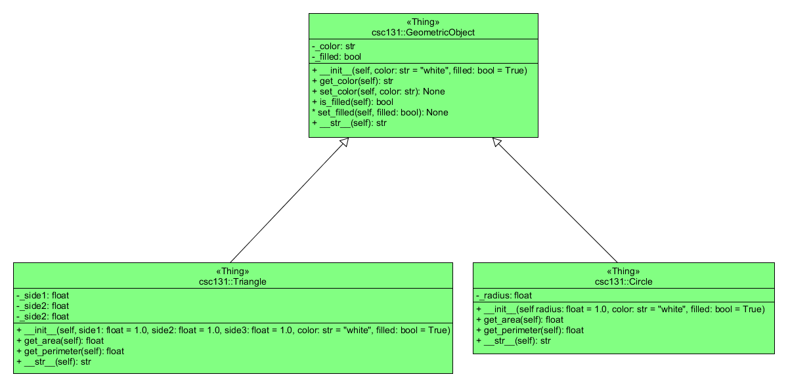

## Lab 5 - Geometric Object

### Introduction

In this lab we explore the concept of inheritance. In particular, we'll implement the following class hierarchy:



Before we begin, study the [GeometricObject](csc131/GeometricObject.py) class.

### Tasks
 
Write the code for a class named `Circle` that extends the `GeometricObject` class. The `Circle` class contains:

* An instance variables `radius` that represents the radius of the `Circle`.
* A constructor that creates a circle with specified radius, color, and filled. Use default values 1.0 for radius, "white" for color, and True for filled. Notice that the instance variables for color and filled are inherited from the superclass.
* A method named `get_area()` that returns the area of this `Circle`. 
* A method named `get_perimeter()` that returns the perimeter of this `Circle`.
* An `str` method to return a string representation of the form "Circle: radius = 3 color: red and filled: True". (assume that 3, red, and True are the values for the corresponding instance variables of the Circle object on whose behalf the method was called.) This `str` method should append the string representation returned from `GeometricObject.__str__(self)` to get the part of the message that says "color: red and filled: True". 

Note: The value of PI can be computed as `4 * math.atan(1)`.

Write the code for a class named `Triangle` that extends the `GeometricObject` class. The `Triangle` class contains:

* Instance variables `side1`, `side2`, and `side3` that denote the three sides of the `Triangle`.
* A constructor that creates a triangle with specified `side1`, `side2`, `side3`, `color`, and `filled`. Use default values 1.0 for the sides, "white" for color, and True for filled. Notice that the instance variables for color and filled are inherited from the superclass.
* A method named get_area() that returns the area of this triangle. The formula for computing the area of a triangle is:
    ```python
    s = (side1 + side2 + side3) / 2
    area = sqrt(s(s - side1)(s - side2)(s - side3))
    ```
* A method named get_perimeter() that returns the perimeter of this triangle .
* An `str` method to return a string representation of the form "Triangle: side1 = 3 side2 = 4 side3 = 5 color: blue and filled: True". (assume that 3, 4, 5, blue, and True are the values for the corresponding instance variables of the Triangle object on whose behalf the method was called.)

Included in this project there is a [demo program](csc131/GeometricDemo.py) that demonstrates your `Circle` and `Triangle` classes and some of the methods inherited from the class `GeometricObject`. A sample run of this demo program is as follows:

```text
Circle: radius = 5 color: blue and filled: False

Entering input values for a circle
Enter value for radius: 3
Circle: radius = 3.0 color: white and filled: True
c1.get_area()      = 28.27
c1.get_perimeter() = 18.85
c1.get_color()     = white
c1.is_filled()     = True

Entering input values for a triangle
Enter value for side1: 2
Enter value for side2: 4
Enter value for side3: 6
Enter color of the triangle: Magenta
Is the triangle filled (1/0)? 1
Triangle: side1 = 2.0 side2 = 4.0 side3 = 6.0 color: Magenta and filled: True
t1.get_area()      = 0.00
t1.get_perimeter() = 12.00
t1.get_color()     = Magenta
t1.is_filled()     = True
```

### Submission Details

The usual assignment protocol is followed:

1. Accept this assignment using the URL found in the Blackboard assignment which creates your repository in your GitHub account.
1. Clone your repository and create a branch named develop within which to do your work.
1. Implement the code indicated by the # TODO: comments.
1. Minimally make commits after finishing each function; more commits are encouraged but not required.
1. Once all the unit tests pass, push your final commit to GitHub and create a pull request, requesting to merge your develop branch into your master branch.
1. After the pull request is created, copy the URL of the pull request and paste it into a Text Submission on Blackboard. You should make the URL a working hyperlink that opens the pull request in a new browser window. NOTE: The assignment is officially submitted by the act of creating and submitting this Blackboard Text Submission and it is the timestamp of that activity that dictates when your assignment was actually submitted.

### Due Date

Your assignment must be submitted to Blackboard by 17:00 Tuesday 27 February 2018.